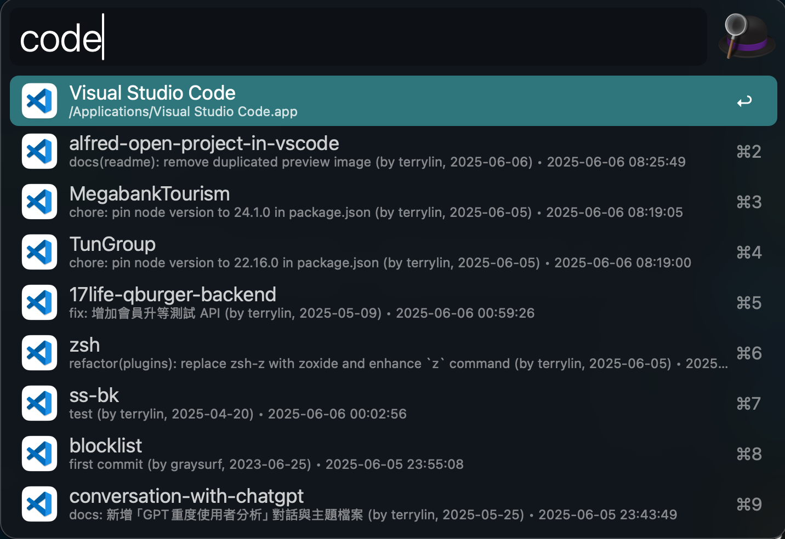

# Open Project in VSCode · Alfred Workflow

Fuzzy-find and open any Git project from one or more base directories in Visual Studio Code, sorted by recent usage.

## 🚀 Features

- Recursively scan `$HOME/Project` or other custom paths (supporting multiple).
- Show last Git commit + last opened timestamp.
- Sorted by most recently accessed project.
- Works offline, no plugin managers required.

## 🔧 Configuration

Set these via Alfred's ⚙️ "Configure..." interface:

| Variable       | Description                                                                 |
|----------------|-----------------------------------------------------------------------------|
| `PROJECT_DIRS` | Comma-separated paths to scan. Supports `$HOME`, `~`, etc.                  |
| `USAGE_FILE`   | Path to the usage log (default: `$HOME/.alfred_project_usage.log`)          |

## ⬇️ Download

**[👉 Click to download .alfredworkflow](https://github.com/user-attachments/files/20615787/open-project-in-vscode.alfredworkflow.zip)**

## 📸 Screenshots

---
> Visual Studio Code icon © Microsoft, used here for integration clarity.

---

## 🪪 License

This project is licensed under the [CC0 1.0 Universal (Public Domain Dedication)](LICENSE).  
You are free to use, modify, distribute, and integrate it without any restrictions or attribution.
